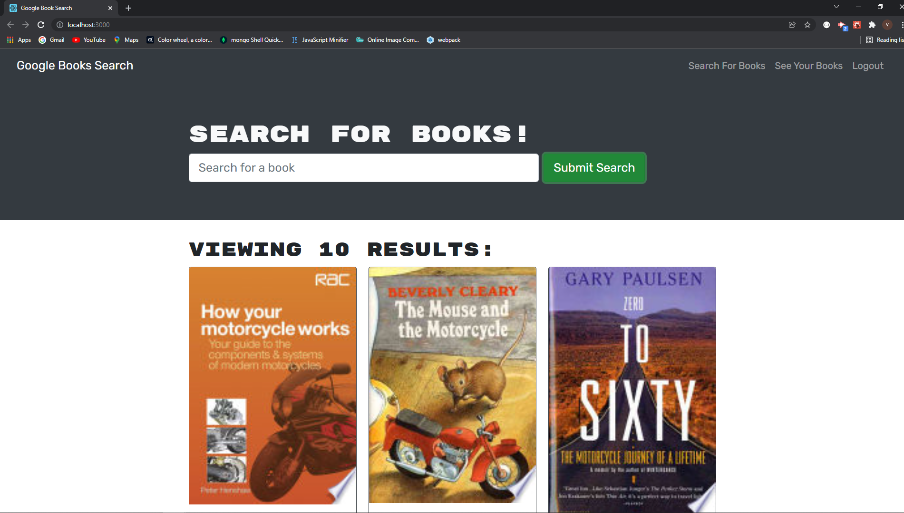

# Book Search

[Book Search](https://readabooktoday.herokuapp.com/)

## Application Description
This is an application that allows users to sign up or login to an account. The user has the ability to search and save books that have been retrieved from Google. This application uses GraphQL APIs and is connected through the Apollo server.

## Table of Contents
* [Description](#application-description)
* [Installation](#installation)
* [Usage](#usage)
* [License](#license)
* [Contributions](#contributions)
* [Testing](#testing)
* [Questions](#questions)

## Installation
Use npm install to install packages.

## Usage
Free to use.

## License
N/A

## Contributions
You can contribute by creating a new issue.

## Testing
N/A

## Questions
Please feel free to reach out with any questions or concerns. I can be reached at victorj500@gmail.com or on GitHub at github.com/vic-smith.

